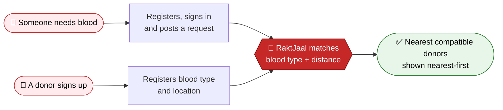
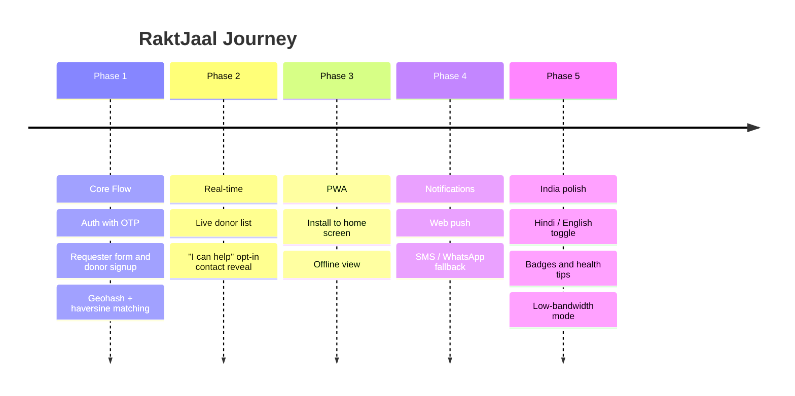

<div align="center">


<a href="https://raktjaal.vercel.app/">
  
</a>

<br/>

**A connected network that helps blood donors and receivers find each other, fast.**

<br/>


<br/>

[**🌐 Live Demo**](https://raktjaal.vercel.app/) &nbsp;•&nbsp;
[**🚀 Quick Start**](#-quick-start) &nbsp;•&nbsp;
[**✨ Features**](#-features) &nbsp;•&nbsp;
[**🗺️ Roadmap**](#️-roadmap) &nbsp;•&nbsp;
[**🐞 Report a Bug**](https://github.com/samsara0902/Raktjaal-connected-network-for-blood-donor-and-reciever/issues)

</div>

<br/>

---

## 😟 The Problem

Think about how a blood request usually happens in India today.

Someone in a hospital panics and posts a message on a WhatsApp group or an Instagram story. It gets forwarded a dozen times. By the time it reaches a donor who is compatible **and** nearby, the window has often closed.

> 🩸 *The blood exists. The donors exist. They just never find each other in time.*

<br/>

## 💡 Our Solution

**RaktJaal replaces the forwarding chain with a direct, location-aware match.**

Post a request or register as a donor, and the app finds compatible people within a real radius in seconds. No group forwarding. Just register, sign in, and get matched with the right people nearby.

<table>
<tr>
<td align="center" width="33%">
<h3>⚡ Fast</h3>
Matches in seconds, not hours of forwarding
</td>
<td align="center" width="33%">
<h3>📍 Local</h3>
Only compatible donors within a real 10 km radius
</td>
<td align="center" width="33%">
<h3>🔐 Secure</h3>
Verified accounts with email OTP and Google sign-in
</td>
</tr>
</table>

<br/>

---

## 🔄 How It Works



<details>
<summary><b>🔬 Curious how the matching works under the hood?</b></summary>

<br/>

1. Every donor is saved with a **precision-6 geohash** of their location.
2. A request searches the **centre cell and its 8 neighbours**, so a donor just across a cell boundary isn't missed.
3. Every candidate is re-checked with the **haversine formula** against a true **10 km** radius.
4. Results are sorted **nearest-first**.

</details>

<br/>

---

## ✨ Features

### 🔑 Sign in, safely

| | |
| :-- | :-- |
| 📧 **Email + Google** | Sign in with email and password, or tap "Continue with Google" |
| 🔢 **OTP verification** | New email accounts must verify a 6-digit code sent to their inbox |
| 🔁 **Password reset** | Forgot it? Reset by email |
| 💬 **Friendly errors** | Clear messages instead of cryptic Firebase codes |

### 🩸 Core flow

<table>
<tr>
<td width="50%" valign="top">

#### 🆘 Ask for blood
*Sign in to post a request*

- Blood type, units and hospital
- Urgency level and contact number
- Use browser location or enter coordinates
- Instantly see matching donors

</td>
<td width="50%" valign="top">

#### 🙋 Become a donor
*Register once, help many times*

- Add name, phone, blood type and location
- Phone numbers are **never shown** in match lists
- Stored securely, matched by distance

</td>
</tr>
</table>

### 👤 Profile and account

- 🖼️ **Photo upload:** auto-cropped to a square and compressed under 400 KB
- 🔒 **Blood group lock:** once saved, it can't be changed by accident. "Contact us to change" opens a pre-filled email to our team
- 📨 **Security alerts:** you get an email whenever your password changes
- 📜 **Donation history:** verified donations only
- 🗑️ **Safe deletion:** OTP-protected, and removes your login and profile together

### 🎨 Look and feel

A full landing page, redesigned auth screens, and a two-tab **Need Blood / Donate Blood** screen shown right after login.

<br/>

---

## 🛠️ Tech Stack

<div align="center">

| Layer | Technology |
| :-- | :-- |
| 🖥️ **Frontend** | Next.js 14 (App Router) · TypeScript / JSX · Tailwind CSS |
| 🔐 **Authentication** | Firebase Auth (email/password + Google) |
| 🗄️ **Database** | Firebase Firestore |
| ⚙️ **Server / API** | Next.js Route Handlers · Firebase Admin SDK |
| 📧 **Email (OTP)** | Nodemailer over Gmail SMTP |
| 📍 **Geo matching** | `ngeohash` (precision 6) + haversine distance |
| 🎯 **Icons** | lucide-react |

</div>

<br/>

---

## 🚀 Quick Start

**You'll need:** Node.js 18+, a Firebase project, and a Gmail [App Password](https://myaccount.google.com/apppasswords) for sending OTP emails.

```bash
# 1. Clone
git clone https://github.com/samsara0902/Raktjaal-connected-network-for-blood-donor-and-reciever.git
cd Raktjaal-connected-network-for-blood-donor-and-reciever

# 2. Install
npm install

# 3. Add your config
cp .env.example .env.local

# 4. Run
npm run dev
```

Open **http://localhost:3000** and you're live 🎉

> 🔑 **Need the `.env.local` values?** Contact [@samsara0902](https://github.com/samsara0902) and we'll share the configuration with you. Never commit your real `.env.local` file to GitHub.

<details>
<summary><b>🔥 Firebase setup (step by step)</b></summary>

<br/>

1. Create a project at [console.firebase.google.com](https://console.firebase.google.com).
2. Enable **Firestore Database** (production mode) and paste the contents of `firestore.rules` into the Rules tab.
3. Go to **Authentication → Sign-in method** and enable **Email/Password** and **Google** (set a support email when asked).
4. Under **Project settings → General → Your apps**, add a **Web app** and copy its config into `.env.local`.
5. Make sure `localhost` (dev) and your real domain (prod) are in **Authentication → Settings → Authorized domains**.
6. Generate a **service account key** (Project settings → Service accounts → Generate new private key) and fill in the `FIREBASE_ADMIN_*` variables.

</details>

<details>
<summary><b>📧 Email OTP environment variables</b></summary>

<br/>

Add these **server-only** variables to `.env.local`:

| Variable | What it is |
| :-- | :-- |
| `FIREBASE_ADMIN_PROJECT_ID` | From your service account key |
| `FIREBASE_ADMIN_CLIENT_EMAIL` | From your service account key |
| `FIREBASE_ADMIN_PRIVATE_KEY` | From your service account key (may contain `\n` line breaks) |
| `SMTP_USER` | Gmail address that sends the OTP emails |
| `SMTP_PASSWORD` | Gmail **App Password**, not your normal password (2-Step Verification must be on) |
| `SMTP_HOST` | *Optional.* Defaults to `smtp.gmail.com` |
| `SMTP_PORT` | *Optional.* Defaults to `465` |

> 🔒 Never prefix these with `NEXT_PUBLIC_`. They must stay on the server.

</details>

<br/>

---

## 📁 Project Structure

<details>
<summary><b>Click to expand the folder tree</b></summary>

<br/>

```
Raktjaal/
├── src/
│   ├── app/                              # Pages and API routes (Next.js App Router)
│   │   ├── page.jsx                      #   Landing page
│   │   ├── login/ · register/            #   Auth screens (shared AuthPage)
│   │   ├── action/                       #   "Need Blood" / "Donate Blood" screen
│   │   ├── profile/                      #   Account settings, security, delete account
│   │   ├── request/                      #   Request form + match results ([id])
│   │   ├── donor/signup/                 #   Donor registration
│   │   └── api/
│   │       ├── email-otp/                #   Send + verify OTP
│   │       ├── account/                  #   Delete account, disable 2-step
│   │       ├── email/password-changed/   #   Security notification email
│   │       └── admin/unlock-blood-type/  #   Admin-only blood group unlock
│   │
│   ├── frontend/
│   │   ├── components/                   #   NavBar, SiteChrome, DonorCard, GoogleButton, AuthPage
│   │   └── hooks/                        #   useAuth, useGeolocation
│   │
│   └── backend/
│       ├── lib/                          #   firebase, auth, emailOtp, matching, geohash, userProfile
│       └── types/                        #   Shared types (Donor, BloodRequest, DonorMatch...)
│
├── firestore.rules                       # Database security rules
└── .env.example                          # Config template
```

</details>

<br/>

---

## 🔐 Security and Privacy

People trust us with health-related details, so we take this seriously.

<table>
<tr>
<td width="50%" valign="top">

### ✅ Already protected

- 🔢 OTPs are **SHA-256 hashed**, expire in **10 minutes**, allow **5 wrong attempts**, with a **60-second resend cooldown**, all enforced server-side
- 📵 Donor phone numbers are never shown in match lists
- 🧱 Blood group changes are blocked by database rules, not just the UI
- 🛑 Turning off two-step verification needs a fresh emailed OTP
- 📬 OTP data is only touched by the server (Admin SDK)

</td>
<td width="50%" valign="top">

### 🚧 Relaxed in Phase 1

To move fast in Phase 1, the current `firestore.rules` are permissive:

- Donor documents are readable so matching can run client-side
- Blood request rules are not yet locked down at the database level

**Before a public launch:** move `phone` into a subcollection or a Cloud Function–mediated reveal, so this is enforced at the database layer.

</td>
</tr>
</table>

<details>
<summary><b>🛡️ Admin guide</b></summary>

<br/>

**Unlocking a user's blood group**

When a user emails proof to `raktjaal@gmail.com`, unlock their account with the admin secret:

```bash
curl -X POST https://YOUR-APP/api/admin/unlock-blood-type \
  -H "Content-Type: application/json" \
  -d '{"secret":"<ADMIN_BROADCAST_SECRET>","email":"user@example.com"}'
```

The user gets an in-app notification and can re-select their blood group **once**, after which it locks again. Add `"lock": true` to re-lock without any change.

**Deploying rules:** always deploy Firestore rules **before** the app.

```bash
firebase deploy --only firestore:rules
```

</details>

<br/>

---

## 🗺️ Roadmap



| Phase | Focus | Status |
| :-: | :-- | :-: |
| **1** | Core flow: auth with OTP, requester form, donor signup, geohash matching | ✅ **Built** |
| **2** | Real-time: live donor list (`onSnapshot`), "I can help" action that reveals contact info only after a donor opts in | 🔜 **Next** |
| **3** | PWA: install to home screen, offline view of recent requests and profile | 📋 Planned |
| **4** | Notifications: web push (Firebase Cloud Messaging) + SMS/WhatsApp fallback (Twilio) | 📋 Planned |
| **5** | India-specific polish: Hindi/English toggle, donor badges, health tips, low-bandwidth mode | 📋 Planned |

<br/>

---

## 👥 Team

<div align="center">

Built with ❤️ at **PSIT Kanpur, Department of Data Science**
as a mini project (2026–27)

**Team CS-DS-3A-05**

</div>

<br/>

---

## 📬 Contact

<div align="center">

[](https://github.com/samsara0902)
[](https://instagram.com/n_ashwar)
[](https://raktjaal.vercel.app/)
[](https://github.com/samsara0902/Raktjaal-connected-network-for-blood-donor-and-reciever/issues)

</div>

<br/>

<div align="center">

### 🩸 One donation can save up to three lives.

**If you like this project, give it a ⭐ and share it. You never know who might need it.**

</div>

